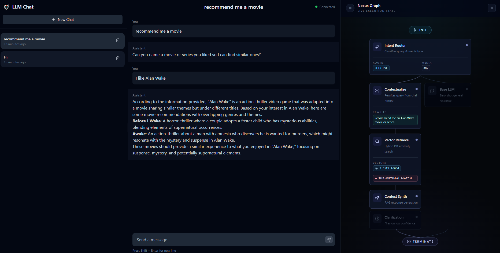
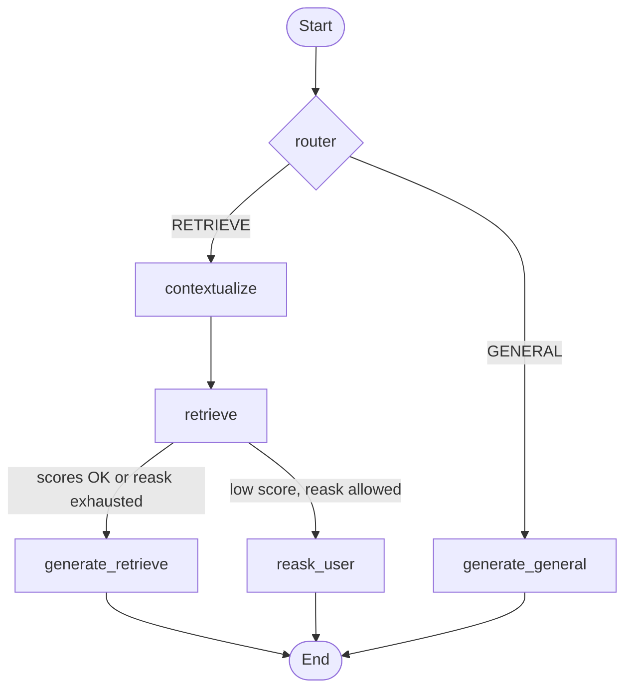

# LangGraph Hybrid Search Movie Recommendator
[](https://www.python.org/)
[](https://github.com/astral-sh/uv)
[](https://github.com/astral-sh/ruff)
[](LICENSE)




## Table of Contents
- [Project Overview](#project-overview)
- [Project Structure](#project-structure)
- [Main Technologies Used](#main-technologies-used)
- [Features](#features)
- [How to run](#run)
- [Credits](#credits)
- [License](#license)


## Project Overview <a id="project-overview"></a>

**RAG** application for movie analysis and recommendation. The backend exposes a conversational assistant that combines:

- **Hybrid search** (dense + sparse) over reviews indexed in Qdrant, with optional re-ranking.
- **LangGraph** to orchestrate the assistant flow (search, context, generation).
- **LiteLLM** as a unified proxy to the LLM (Ollama by default; configurable to OpenAI, vLLM, etc.).
- **WebSockets** for streaming responses in real time to the frontend.

The frontend is a chat interface that connects to the backend via WebSocket, allowing users to converse with the assistant and receive movie recommendations with streaming responses.


## Project Structure <a id="project-structure"></a>

```
movie_recommendator/
├── backend/                    # API FastAPI + LangGraph + Qdrant
│   ├── src/app/
│   │   ├── api/v1/endpoints/   # REST and WebSocket routes (thin layer)
│   │   ├── assistants/         # LangGraph state machine (movie_assistant)
│   │   ├── core/config/        # Settings and logging
│   │   ├── crud/               # DB access layer (conversation_crud)
│   │   ├── db/                 # Session factory and schema init
│   │   ├── entities/           # SQLModel ORM models (Conversation, Message)
│   │   ├── etl/                # Qdrant population from Kaggle datasets
│   │   ├── prompts/            # LLM prompt templates per graph node
│   │   ├── schemas/            # Pydantic request/response schemas
│   │   ├── services/           # Retriever, LLM client, history compressor
│   │   └── websocket/          # WebSocket layer (handler, generation, session, protocol)
│   ├── litellm_config.yaml     # LiteLLM model configuration (see LiteLLM)
│   ├── pyproject.toml
│   └── Dockerfile
├── frontend/                   # Chat UI (React + Vite)
│   ├── src/
│   │   ├── components/chat/    # ChatView, ChatInput, Sidebar, LangGraphPanel
│   │   ├── providers/          # WebSocketProvider
│   │   ├── lib/                # config, api, types
│   │   └── service/            # ws.ts (WebSocket client)
│   └── package.json
├── docker-compose.yml          # Qdrant, Postgres, Ollama, LiteLLM, backend
├── Justfile                    # Local commands (sync, run-backend, run-frontend)
└── README.md
```


## Main Technologies Used <a id="main-technologies-used"></a>

### Core Framework & Language
- **Python 3.13**: The main programming language used for the entire project, providing modern features and performance improvements.

### RAG & LLM Frameworks
- **LangChain**: A comprehensive framework for building applications with Large Language Models (LLMs). It provides abstractions and tools for chaining together different components like prompt templates, LLMs, vector stores, and memory systems to create sophisticated AI applications.

- **LangGraph**: An extension of LangChain that enables building stateful, multi-actor applications with LLMs. It allows you to create complex workflows and agentic systems by modeling applications as graphs where nodes represent steps and edges represent transitions, making it ideal for building advanced RAG pipelines with multiple decision points.

### Vector Database & Embeddings
- **Qdrant**: A high-performance vector database designed for similarity search and storing embeddings. It enables efficient retrieval of semantically similar documents and supports advanced filtering capabilities for hybrid search strategies.

### Infrastructure & Deployment
- **Docker**: Containerization platform used for packaging and deploying the application and its dependencies in a consistent, isolated environment.

### LiteLLM

**[LiteLLM](https://github.com/BerriAI/litellm)** is a proxy that unifies access to multiple LLM providers behind an OpenAI-compatible API. In this project:

- The backend does not call Ollama (or OpenAI, vLLM, etc.) directly, but **LiteLLM** (by default on port 4000).
- LiteLLM translates requests to the configured provider's format and returns responses in a standard format, allowing you to **switch model or provider** without touching the backend code.
- Model configuration (names, routes, API base) is defined in **`backend/litellm_config.yaml`**. There you list the models (e.g. `primary-llm` → `ollama/llama3.1`, `secondary-llm` → `ollama/llama3.2:1b`) and the `api_base` (e.g. `http://ollama:11434`). To use another backend (vLLM, OpenAI, etc.) just edit that file: add or change entries in `model_list` and adjust `litellm_params` (`model`, `api_base`, api_key if applicable). The docker-compose includes Ollama for convenience, but LiteLLM allows replacing or complementing it with any compatible API.


## Features <a id="features"></a>

### WebSocket (WS) <a id="websocket-ws-features"></a>

Real-time communication between the frontend and backend is done via **WebSockets**:

- **Backend**: FastAPI exposes a WebSocket endpoint (e.g. `/api/v1/ws/movies`) that accepts JSON messages. The assistant processes each query (RAG + LangGraph), calls the LLM through LiteLLM and streams the response over the same WebSocket.
- **Frontend**: A `WebSocketProvider` (React) keeps the connection alive; the service (`ws.ts`) opens the socket, sends typed payloads and parses incoming events.

**Client → Server message types:**

| Type | Description |
|------|-------------|
| `start_conversation` | Start a new conversation; body includes `message` (first user message). The server creates a conversation in Postgres and starts generation. |
| `resume_conversation` | Switch to an existing conversation by `convo_id`; no new message is sent. |
| `message` | Send a user message in the current conversation; triggers RAG + LangGraph generation. |
| `interrupt` | Ask the server to stop the current generation immediately (see [Chat Interruption](#chat-interruption)). |

**Server → Client event types:**

| Type | Description |
|------|-------------|
| `thinking_start` / `thinking_end` | Delimit the “thinking” phase before response chunks. |
| `conversation_started` / `conversation_resumed` | Confirm new or resumed conversation; payload is the conversation ID. |
| `response_chunk` | A piece of the assistant’s reply (streaming). |
| `done` | Generation finished. |
| `graph_start` / `graph_end` | Delimit one LangGraph run. |
| `node_start` / `node_end` / `node_output` | LangGraph node lifecycle and optional outputs (reformulated question, decision, document count); used by the [LangGraph panel](#langgraph-flow) in the UI. |
| `interrupt_ack` | Server confirms that the interrupt was applied. |
| `error` | Error message (e.g. no active conversation, generation failure). |

Benefits: low perceived latency, a single persistent connection, and native support for streaming text and live graph updates.


### HybridSearcher <a id="hybridsearcher"></a>

The **HybridSearcher** (`backend/src/app/services/retriever.py`) performs hybrid (dense + sparse) search over the movie/TV corpus stored in Qdrant:

- **Dense vectors**: One embedding model (e.g. sentence-transformers) indexes semantic meaning; search uses cosine similarity.
- **Sparse vectors**: A sparse model (e.g. BM25-style) indexes lexical/keyword matches.
- **Fusion**: Qdrant’s **RRF (Reciprocal Rank Fusion)** combines dense and sparse results into a single ranking.
- **Optional re-ranking**: A cross-encoder reranker can refine the top candidates (e.g. top 15 → rerank → top 5) for better relevance.

The same class is used both to **index** documents (during `populate_movies_qdrant`) and to **search** at query time inside the LangGraph “retrieve” node. Configuration (model names, collection name, Qdrant URL) comes from `qdrantsettings`.


### Chat Interruption <a id="chat-interruption"></a>

Users can **stop an in-progress assistant reply** at any time:

1. **Frontend**: The chat UI exposes an interrupt control (e.g. stop button). When clicked, the client sends a WebSocket message with `type: "interrupt"`.
2. **Backend**: The WebSocket handler (`websocket/handler.py`) maintains an `interrupt_event` (`asyncio.Event`). On `interrupt`, it sets this event and waits for the current generation task to finish. The LangGraph stream loop in `websocket/generation.py` checks the event each iteration and exits as soon as it is set.
3. **After interrupt**: The server sends `interrupt_ack` to the client. If the model had already produced some text, that partial reply is kept and the handler appends `[message interrupted by the user]` before saving the message to Postgres. So the conversation history still contains the truncated turn plus the interrupt marker.

This also applies when the client disconnects mid-generation (tab close, page refresh, navigation). The DB write always runs regardless of connection state, so the partial response with the interrupted suffix is preserved and visible when the user returns to the conversation.


### Conversations <a id="change-conversation-name"></a>

- Create new conversations; resume existing ones from the sidebar.
- Edit conversation name (title) from the chat header.
- Messages are saved in **PostgreSQL** and used as context by the assistant for the next replies.


### LangGraph Flow <a id="langgraph-flow"></a>

The assistant is implemented as a **LangGraph** state machine in `backend/src/app/assistants/movie_assistant.py`. The graph decides whether to run retrieval (RAG) or answer in general chat.

**Graph structure (Mermaid):**



**Node roles:**

| Node | Role |
|------|------|
| **router** | Runs first on the last user message: **RETRIEVE** (needs movies/reviews from the vector DB) or **GENERAL** (general chat, no retrieval), plus **media_type** for Qdrant filtering. Uses a secondary/smaller LLM. |
| **contextualize** | Only on the RETRIEVE path: rewrites the message using recent chat history so it is self-contained (e.g. “make it shorter” → “make the list of recommendations shorter”). Uses the secondary LLM. |
| **retrieve** | Calls **HybridSearcher** with the contextualized question and optional rerank; sets **needs_reask** when the best score is below threshold. |
| **generate_retrieve** | Builds the final answer from retrieved context and chat history (RAG path). |
| **reask_user** | When retrieval quality is low and re-ask budget allows, asks the user for more specifics; otherwise the graph falls through to **generate_retrieve** (see `route_after_retrieve` in code). |
| **generate_general** | Answers without retrieval, using only chat history (general path). |

**Frontend visualization of the graph**

The **LangGraph panel** (e.g. `LangGraphPanel.tsx`) shows the same flow in the UI:

- **Node cards**: One card per node (Router, Contextualize, Retrieve, Generate (RAG), Re-ask, General Answer). Each card shows an icon, label, short description, and optional **outputs** (e.g. reformulated question, decision, document count) when the backend sends `node_output` events.
- **Status**: Each node has a status—**idle** (gray), **active** (purple, current step), **completed** (green), or **error** (red). The backend drives this via `node_start` / `node_end` and the execution path.
- **Execution path**: A vertical layout mirrors the Mermaid flow: Start → router → on **RETRIEVE**, contextualize → retrieve → then either generate (RAG) or re-ask; on **GENERAL**, generate_general. Edges (lines/splits) are highlighted (e.g. purple when active, green when completed) so the user sees which branch is taken and which node is running.
- **Live updates**: During streaming, `graph_start` / `graph_end` and `node_start` / `node_end` / `node_output` WebSocket events update the panel so the graph animates in real time and shows the router’s decision and retrieval count without leaving the chat.


### Datasets (Kaggle) <a id="datasets-kaggle"></a>

The Qdrant index is populated from two **Kaggle** datasets (used by default when no CSV paths are passed to the populate script):

1. **IMDb-style dataset (movies)**  
   - **Kaggle**: [payamamanat/imbd-dataset](https://www.kaggle.com/datasets/payamamanat/imbd-dataset)  
   - Used for movies-only records (e.g. title, stars, genre, description, duration).

2. **Netflix shows (movies + TV)**  
   - **Kaggle**: [shivamb/netflix-shows](https://www.kaggle.com/datasets/shivamb/netflix-shows)  
   - Used for mixed movies/TV (e.g. title, director, cast, listed_in, description, type).

Download is done via **kagglehub** inside `backend/src/app/etl/populate_qdrant_movies.py` when you run the init/profile without providing `-m` / `-x` paths. You need Kaggle API credentials configured for automatic download; otherwise you can download the datasets from the links above and pass the CSV paths to the script.


## How to run <a id="run"></a>

### With Justfile (local)

1. **Backend dependencies**
   ```bash
   just sync
   ```

2. **Qdrant database and data**  
   You need Qdrant (and optionally Postgres) running. The easiest way with Docker is to use the compose and the `init` profile to populate Qdrant:
   ```bash
   docker compose up -d
   docker compose --profile init up
   ```
   The `init` profile starts the `qdrant-init` service, which runs the script to populate movies in Qdrant.

3. **Backend**
   ```bash
   just run-backend
   ```

4. **Frontend**
   ```bash
   just run-frontend
   ```

If you use models via Ollama (as in the compose example), make sure you have the models downloaded, for example:
```bash
docker exec -it ollama ollama pull llama3.1
docker exec -it ollama ollama pull llama3.2:1b
```

### With Docker (docker-compose)

1. **Start all services** (Qdrant, Postgres, Ollama, LiteLLM, backend):
   ```bash
   docker compose up -d
   ```

2. **Populate Qdrant** (movie index):
   ```bash
   docker compose --profile init up
   ```

3. Optional: download models in the Ollama container (see `ollama pull` commands above).

The `docker-compose` includes **Ollama** as the default LLM service. Thanks to **LiteLLM**, you can switch to another provider (vLLM, OpenAI, etc.) without modifying the backend: just edit **`backend/litellm_config.yaml`** (add/change models and `api_base` or api_key) and, if needed, add or replace the corresponding service in `docker-compose`. The backend will keep calling LiteLLM on port 4000.


## Credits <a id="credits"></a>

- **Frontend**: based on the [tiny-ollama-chat](https://github.com/anishgowda21/tiny-ollama-chat/tree/master) repository by **Anish Gowda**.
- **Retriever**: thanks to **[@davcamunezr](https://github.com/davcamunezr)** for help with the hybrid retriever in `backend/src/app/services/retriever.py`.


## 📄 License <a id="license"></a>

MIT – free to use, modify and distribute.
